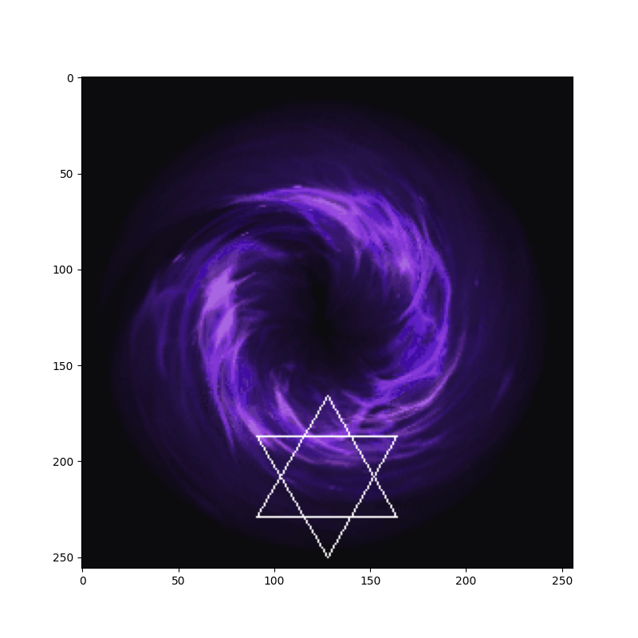
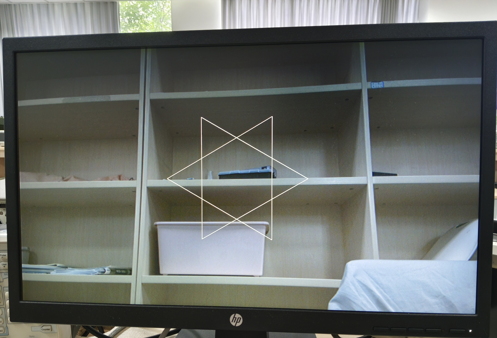

# fpga-axis-video-overlay

AXI4-Stream pixel overlay engine with run-length encoding. Source-only distribution — import into any FPGA project.

## Demo

| `play_video.py` Visualization | HDMI Output |
|:---:|:---:|
|  |  |

## What It Does

This IP sits inline on an AXI4-Stream video pipeline. You write color patterns through an AXI4-Lite register interface as RLE-compressed pixel runs. The engine overlays them onto the live stream while preserving one-pixel-per-cycle throughput. When an overlay item matches, the output is a simple alpha blend between the input pixel and the overlay color.

Patterns are stored in a double-buffered BRAM. Writing hits one bank while the other bank is read. A `commit` register initiates a bank swap at the next frame boundary, making pattern changes tear-free.

The BRAM read port is synchronous and has an inherent one clock latency. The design hides this latency with a small prefetch fifo so that when the overlay logic moves to the next run-length item, it does not need to insert a bubble cycle to wait for memory.

## Getting Started

### Run the Simulation

1.  Create a new Vivado project (RTL Project, no sources at creation).
2.  Add the source files:
    - `image_filter.v` (top module)
    - `image_filter_slave_lite_v1_0_S00_AXI.v`
    - `fwft_fifo.v`
3.  Add the simulation source:
    - `tb_top.v`
4.  Generate a Block Memory Generator IP named `blk_mem_gen_0` with simple dual-port RAM, 64-bit write / 64-bit read, depth matching twice `ERAM_DEPTH`.
5.  Update the input file paths in `tb_top.v` — search for `$sformat(in_path, …)` and replace the absolute paths with your `InData/` directory location.
6.  Click **Run Behavioral Simulation**.

Block RAM IP parameters:
- Name: blk_mem_gen_0
- Type: simple dual-port RAM (A: write, B: read)
- Data width: 64-bit on both ports
- Address width: ERAM_ADDR_WIDTH+1 bits (bank select + item index)
- Depth: 2 x ERAM_DEPTH (with ERAM_ADDR_WIDTH=13, ERAM_DEPTH is 8192 and total depth is 16384)

The testbench streams 30 frames of raw 256×256 RGB while applying three overlay patterns:

| Frame | Pattern | Color |
|:---:|---|:---:|
| 1 | Hexagram (star of David) | White |
| 10 | Circle (radius 24) | Blue |
| 20 | Square outline (16×16) | Green |

### Visualize Output

```bash
python3 play_video.py
```

Reads the generated `OutData/` frames and plays them as an animation.

## How It Works

```
AXI4-Stream IN ──→ [ pixel_cnt FSM ] ──→ AXI4-Stream OUT
                    │
                match? ───→ overlay color from current item
                    │
       fwft_fifo prefetch hides BRAM read latency
```

Each RLE item is a 64-bit word:

```
[63:40] offset   — start pixel (linear address: y × width + x)
[39:24] run_len  — number of consecutive pixels
[23:0]  RGB      — 24-bit color value
```

Consecutive runs with the same color and contiguous offsets are merged into one entry, reducing BRAM usage.

### Key Design Choices

This IP uses two clock domains. AXI4-Lite typically runs around 133 MHz while the video pipeline runs at 200 MHz, and all cross-domain signals use 2-FF synchronizers.

Bank switching is frame-aligned. Writing `commit_bank = 1` marks the write bank ready, and the hardware waits for the current read frame to finish before swapping banks and clearing the commit flag.

The output pixel format is configurable. The `pixel_format` register selects RGB888, BGR888, RGB565, or BGR565. The same register also selects a discrete alpha level used by the overlay blend.

The stream path uses a small registered stage for timing closure while still using block RAM for the item list. This is done by prefetching items into a small first-word-fall-through fifo.

Timing-related details are handled explicitly. The fifo treats `do_push` as the BRAM read request and `do_push_d` as the one-cycle delayed data-valid. It also predicts pointer movement in the current cycle to avoid overflow, and it issues requests for the current `eram_ptr` so the first item and the last item are both fetched correctly.

The alpha blend is implemented with shift-and-add only. The input pixel is treated as the source, the overlay color is treated as the destination, and alpha is a small set of discrete ratios to keep logic shallow.

## Register Map

| Offset | Name | R/W | Description |
|:---:|------|:---:|------|
| `0x00` | `enable_filter` | R/W | Enable overlay (1 = on) |
| `0x04` | `ERAM_DEPTH` | R | Single-bank ERAM depth (= 2^ERAM_ADDR_WIDTH) |
| `0x08` | `pixel_offset` | R | Current pixel counter |
| `0x0C` | `commit_bank` | R/W | Write 1 to commit, auto-cleared on swap |
| `0x10` | `item_overflow` | R | Sticky overflow flag |
| `0x14` | `active_item_count` | R | Number of items in the active bank |
| `0x18` | `eram_write_ptr` | R | Number of items queued for commit |
| `0x1C` | `pixel_format` | R/W | bits [1:0] select RGB888(00), BGR888(01), RGB565(10), BGR565(11); bits [18:16] select alpha (000=0, 001=1/4, 010=1/2, 011=3/4, others=1) |
| `0x20` | `FRAME_WIDTH` | R | Frame width in pixels |
| `0x24` | `FRAME_HEIGHT` | R | Frame height in pixels |
| `0x28`–`0x2C` | — | — | Reserved |
| `≥0x30` | ERAM Data | W | 64-bit RLE items across two 32-bit writes |

pixel_format combines two controls in one register. Bits [1:0] choose the color encoding used by item data, and bits [18:16] choose the alpha ratio for blending. Alpha 0 means fully overlay color, alpha 1 means fully input pixel, and the intermediate codes select 1/4, 1/2, or 3/4 input pixel contribution.

## Repository Files

| File | Description |
|------|------------|
| `image_filter.v` | Top-level module: AXI-Stream passthrough + overlay logic |
| `image_filter_slave_lite_v1_0_S00_AXI.v` | AXI4-Lite slave: register file + RLE merge + BRAM management |
| `fwft_fifo.v` | Prefetch fifo used by the video clock domain to hide the one-clock BRAM read latency |
| `tb_top.v` | Testbench: 30-frame AXI-Stream simulation with three overlay patterns |
| `play_video.py` | Python script to visualize `OutData/` frames as an animation |
| `InData/` | Input raw frames (256×256, 24-bit RGB) |
| `LICENSE` | MIT License |

## Requirements

- Xilinx Vivado (project uses `blk_mem_gen_0` block RAM IP)
- Python 3 with NumPy and Matplotlib (for `play_video.py`)

## License

MIT — see [LICENSE](LICENSE).
